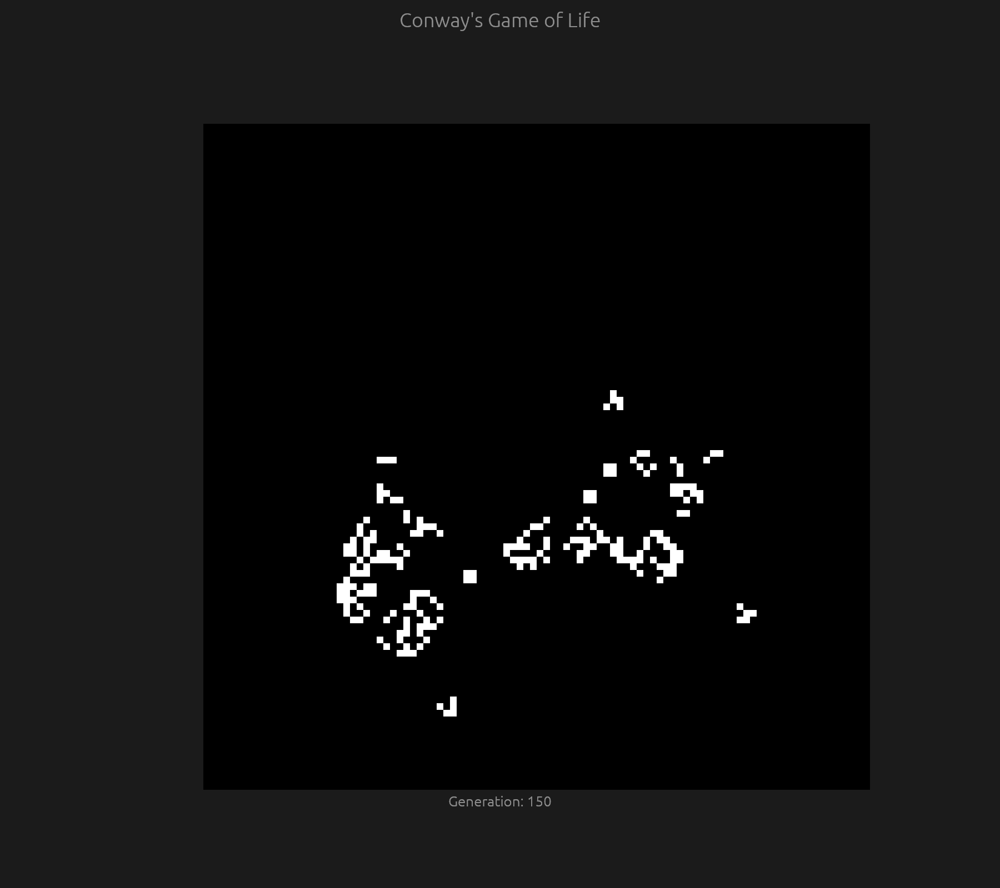
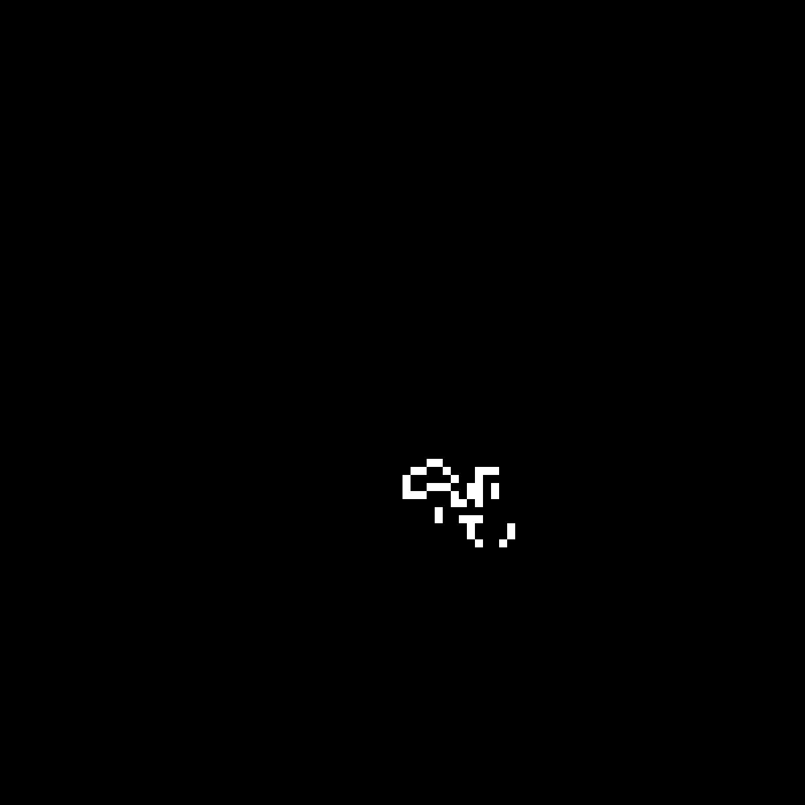
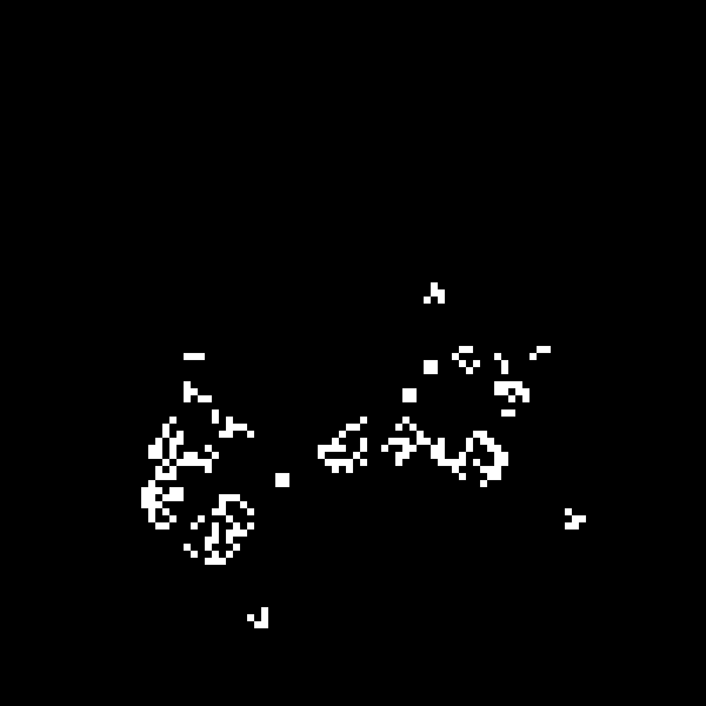
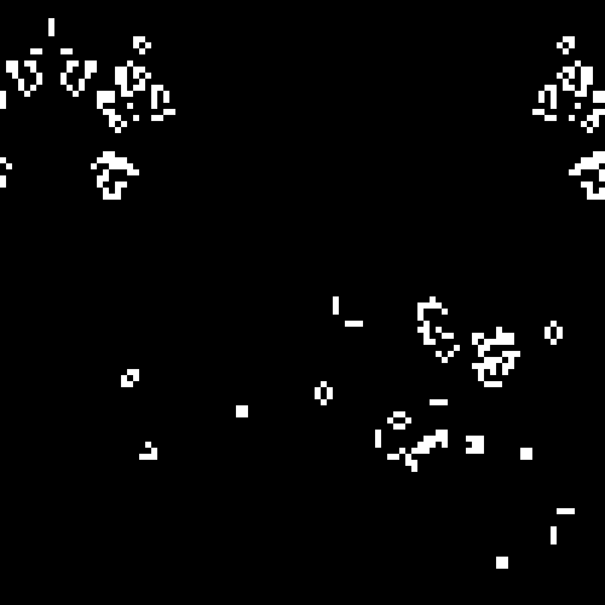
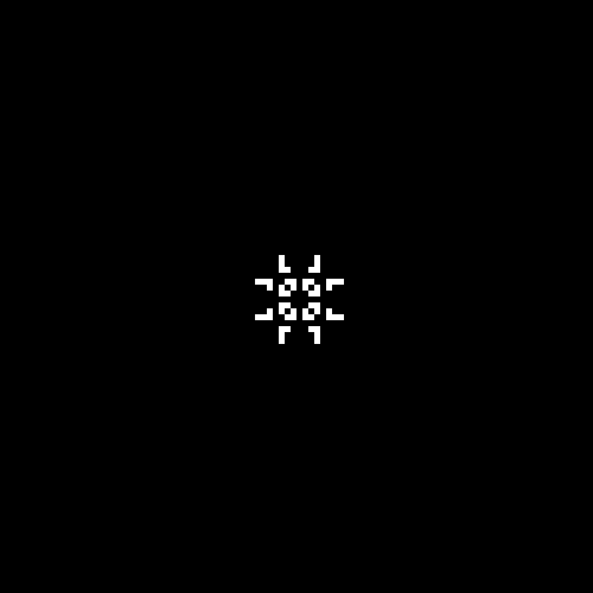
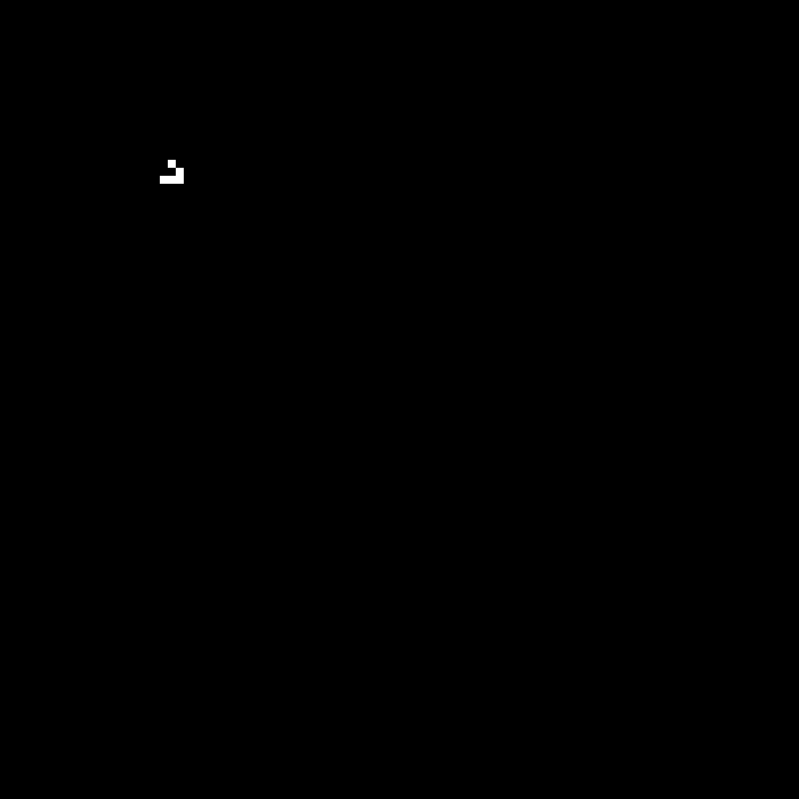
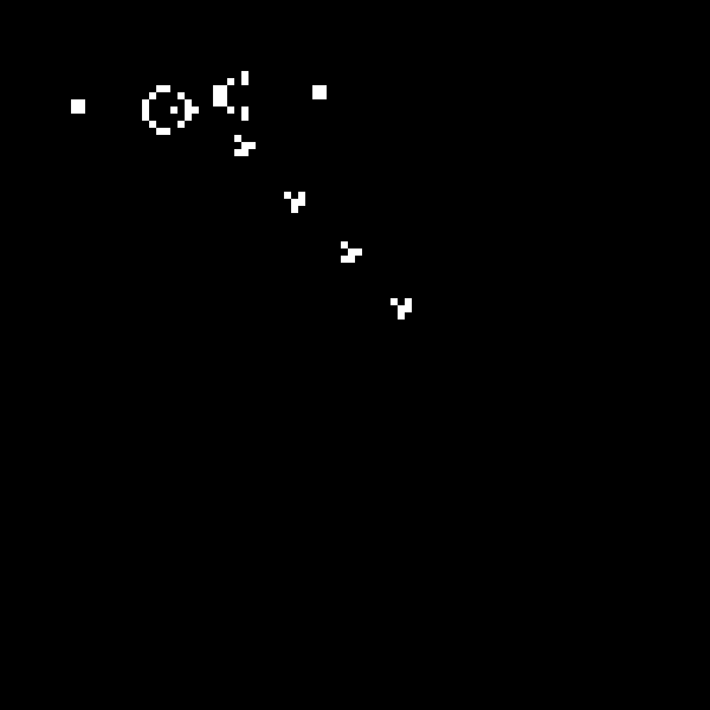
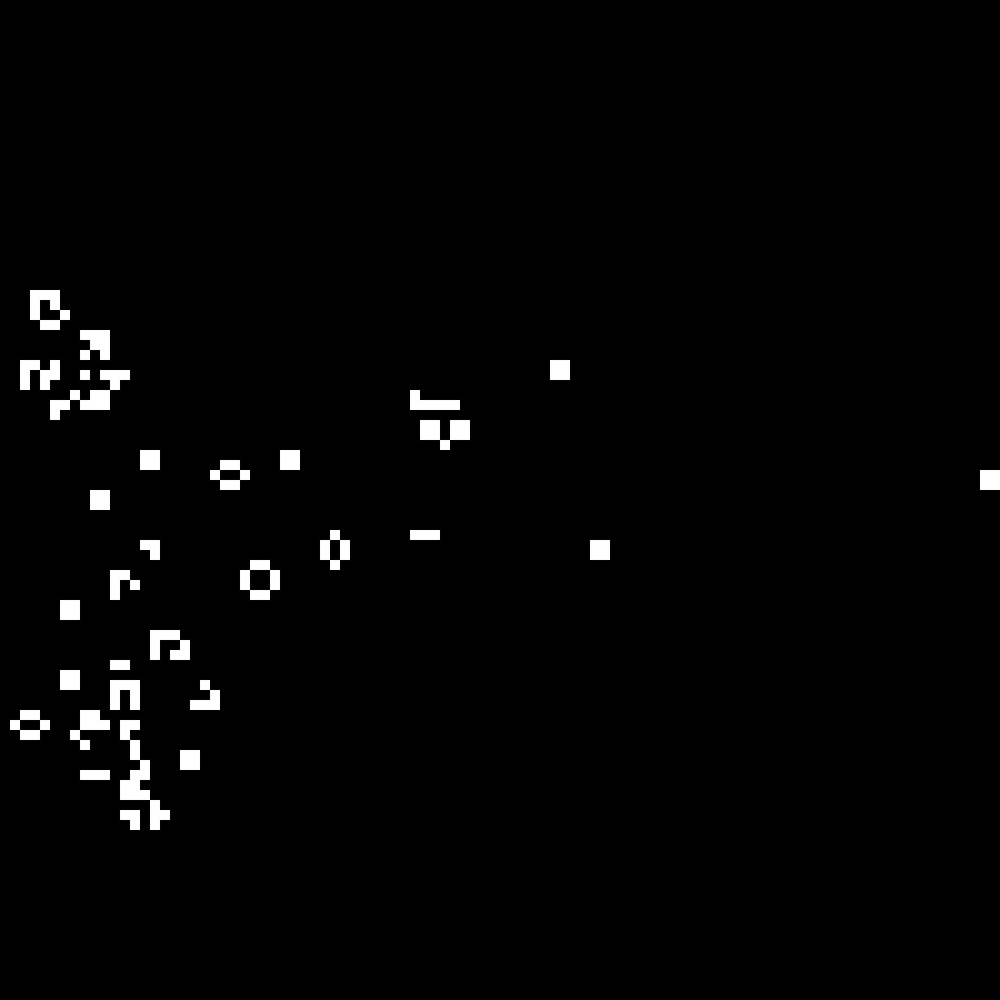

# Conway's Game of Life - Rust

A small desktop implementation of Conway's Game of Life, written in Rust with
[`egui`](https://github.com/emilk/egui)/`eframe`. The grid is a fixed 100x100
board that wraps around at the edges, seeded with a pattern chosen at compile
time, and it steps forward roughly three generations a second.

## To run

- Make sure `rust` is installed.
- Run `cargo run` and it should work as-is.

The window is resizable. It opens at 700x700, which is not quite tall or wide
enough for the whole board plus the generation counter, so drag it a bit larger
(the screenshots here are at roughly 900x800).

## The rules

Every cell looks at its 8 neighbours (horizontal, vertical and diagonal) and
counts how many of them are alive. Then:

1. **Underpopulation** - a live cell with fewer than 2 live neighbours dies.
2. **Survival** - a live cell with 2 or 3 live neighbours stays alive.
3. **Overpopulation** - a live cell with more than 3 live neighbours dies.
4. **Reproduction** - a dead cell with exactly 3 live neighbours comes to life.

That's the whole game. Everything below falls out of those four rules.

### Edges

The real Game of Life is played on an infinite plane, but a real grid has to
stop somewhere. This one uses **toroidal wrapping**: the top row is treated as
adjacent to the bottom row, and the left column adjacent to the right one, as
if the board were wrapped around a doughnut. Nothing falls off the edge, it just
comes back around the other side. Practically, this means a glider will travel
forever, and a pattern that grows large enough will eventually collide with
itself.

## Seeds

The starting pattern is the `SEED` constant near the top of
[`src/lib.rs`](src/lib.rs) - a plain list of `(row, column)` pairs that begin
alive. A handful of the classic patterns are already in there, commented out.
To try one, comment out the current `SEED` and uncomment the one you want, then
`cargo run` again. Exactly one has to be uncommented at a time.

The default is the **R-pentomino**: five cells that refuse to settle down.

| Generation 25 | Generation 150 | Generation 500 |
|:---:|:---:|:---:|
|  |  |  |

The others, roughly in order of how lively they are:

| Seed | What it does |
|---|---|
| `Block` | A still life. Four cells that never change. |
| `Blinker`, `Toad`, `Beacon` | The small oscillators, all period 2. |
| `Pulsar` | A period 3 oscillator, and the best looking one that fits. |
| `Glider`, `Lightweight spaceship` | Spaceships - they translate across the board and, because of the wrapping, loop forever. |
| `Diehard` | Seven cells that thrash about and then vanish completely at generation 130. |
| `Acorn` | Seven cells that take thousands of generations to settle. |
| `Gosper glider gun` | Emits a glider every 30 generations. |

| Pulsar | Glider | Gosper glider gun | Acorn |
|:---:|:---:|:---:|:---:|
|  |  |  |  |

The gun is worth a special mention: it's the first pattern anyone found with
unbounded growth. On this wrapped 100x100 board the gliders it fires eventually
come all the way around and crash into the gun itself, so it doesn't run
forever here.

## Other knobs

All of these are constants at the top of [`src/lib.rs`](src/lib.rs):

| Constant | Default | Meaning |
|---|---|---|
| `ROWS`, `COLUMNS` | `100` | Size of the board. |
| `CELL_SIZE` | `6.0` | Size of one cell in points. The window sizes itself from this. |
| `TITLE`, `APP_NAME` | | Window title and application id. |

The step rate is the `300` in the `request_repaint_after` call at the end of
`App::ui`; lower it to speed the simulation up.

## Layout

- [`src/main.rs`](src/main.rs) - binary entry point. Sets up `tracing` logging
  and calls into the library.
- [`src/lib.rs`](src/lib.rs) - everything else: the seeds, the window setup, the
  `Grid`, the egui drawing code, and the rules themselves in `should_fill` and
  `get_neighbor_count`.

## TODO

The list below came out of a code review by Claude (Anthropic's Claude Code),
which also wrote this README. Nothing here has been acted on yet - the code is
exactly as it was, these are just notes on what could be better.

### Correctness

- [ ] **The generation clock isn't a clock.** `App::ui` gates stepping on
  `!ui.requested_repaint_last_pass()`, which asks "did the previous pass request
  an *immediate* repaint", not "have 300ms passed". In practice that means one
  generation per painted frame. Measured: ~3.6 gen/s when idle (37 generations
  in 10.3s over 41 frames), not the 3.33 that 300ms implies. Worse, if anything
  requests a continuous immediate repaint - an egui widget animation, or any
  `ctx.request_repaint()` - the simulation freezes: with a thread calling
  `request_repaint()` every 20ms the app rendered 690 frames in 10s and never
  left generation 1. By the same mechanism, extra input-driven frames step
  *extra* generations. Fix: keep a `last_step: Instant` and step when
  `elapsed() >= TICK`, leaving `request_repaint_after` as just a wake-up hint.
- [ ] **The seed is never displayed.** The step runs before the paint in the
  same `ui()` call, so the first frame drawn is already generation 1. Stepping in
  eframe's `logic()` hook (which exists for exactly this) fixes it, as does
  gating on a real timer.
- [ ] **Errors don't reach the exit code.** `main.rs` logs the error from
  `cgol_rs::main()` and then returns `Ok(())`, so a failed run still exits 0.
- [ ] `get_neighbor_count` double-counts if `ROWS` or `COLUMNS` drops below 3 -
  the wrapped indices collide and a cell ends up counting itself.
- [ ] An out-of-range seed coordinate panics on startup at
  `grid.cells[x][y] = true`. Worth an assert with a readable message, or a `%`.

### UI

- [ ] **The default window is too small for its own contents.** The
  `padding: f32 = 100.0` accounts for neither the heading, nor the
  `add_space(80.0)`, nor the generation label; and `left_margin = min_width / 4.0`
  (175px) plus a 600px grid needs 775px of a 700px window. At the default size
  the grid is clipped right and bottom and the counter is entirely off-screen.
  The margin should be derived - `(ui.available_width() - grid_width) / 2.0` -
  or left to `vertical_centered` entirely.
- [ ] **~10,000 widget allocations and 10,000 rect shapes per frame.** Every
  cell calls `allocate_exact_size` with a `Sense::hover()` nothing consumes, and
  gets its own `rect_filled`. Allocating the grid as one rect and emitting a
  single `Shape::Vec`/`Mesh` - or painting one black background and drawing only
  live cells - is what makes a bigger grid or a faster tick rate practical.
- [ ] Click-to-toggle cells, and pause/step/reset controls, would make the
  `Sense` actually earn its place.
- [ ] The `persistence` feature is enabled but `App::save` is never implemented,
  so it only buys window-geometry restore. Either use it or drop it.
- [ ] `IconData::default()` passes an empty icon; `None` is more honest.

### Logging

- [ ] `Level::TRACE` as the global max level is why a run buries you in
  winit/wgpu internals. An `EnvFilter` defaulting to `info` and honouring
  `RUST_LOG` is the usual shape.
- [ ] `#[instrument(skip_all)]` on `ui` opens a span every single frame.

### Data structures and tidying

- [ ] `Vec<Vec<bool>>` is 100 separate allocations. A flat `Vec<bool>` indexed
  `i * COLUMNS + j` is simpler and cache-friendlier.
- [ ] `prev_grid` is a scratch buffer, not a grid: its `generation` field is
  dead, and its `rows`/`columns` shadow the constants. Consider one `Grid` with
  a scratch buffer inside it.
- [ ] Both grids are seeded at construction, and one is thrown away on the first
  swap.
- [ ] `3.. => false` in the rules match is only reachable for 4+, since `2 | 3`
  precedes it. Correct, but `4..` would say what it means.
- [ ] `for (i, _) in (0..ROWS).enumerate()` - the `enumerate` is a no-op on a
  0-based range; `for i in 0..ROWS`.
- [ ] Clippy has 4 warnings: `return grid;`, two redundant `as usize` casts, and
  a `match` that wants to be `matches!`.
- [ ] `should_fill`'s doc comment explains toroidal wrapping, but the wrapping
  actually lives in `get_neighbor_count`.

### Tests

- [ ] There are none, despite `should_fill` and `get_neighbor_count` being pure
  functions. A blinker flipping, a block staying put, a glider landing 1 row and
  1 column over after 4 steps, and a corner cell seeing its wrapped neighbours
  are a few lines each.

## License

GNU General Public License v3.0 - see [LICENSE](LICENSE).
